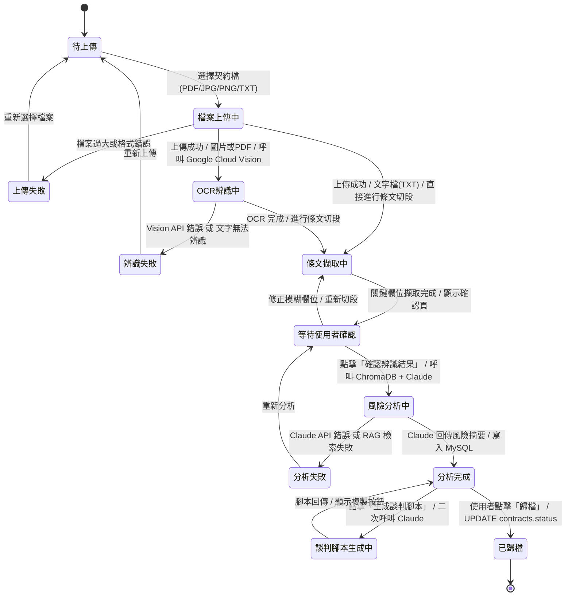

```mermaid
stateDiagram-v2
    direction TB

    state "待上傳" as waiting
    state "檔案上傳中" as uploading
    state "上傳失敗" as upload_failed
    state "OCR辨識中" as ocr_processing
    state "辨識失敗" as ocr_failed
    state "條文擷取中" as extracting
    state "等待使用者確認" as waiting_confirm
    state "風險分析中" as analyzing
    state "分析失敗" as analysis_failed
    state "分析完成" as analysis_done
    state "談判腳本生成中" as generating_script
    state "已歸檔" as archived

    [*] --> waiting

    waiting --> uploading : 選擇契約檔(PDF/JPG/PNG/TXT)
    uploading --> upload_failed : 檔案過大或格式錯誤
    upload_failed --> waiting : 重新選擇檔案

    uploading --> ocr_processing : 上傳成功 / 圖片或PDF / 呼叫 Google Cloud Vision
    ocr_processing --> ocr_failed : Vision API 錯誤 或 文字無法辨識
    ocr_failed --> waiting : 重新上傳

    uploading --> extracting : 上傳成功 / 文字檔(TXT) / 直接進行條文切段
    ocr_processing --> extracting : OCR 完成 / 進行條文切段
    extracting --> waiting_confirm : 關鍵欄位擷取完成 / 顯示確認頁

    waiting_confirm --> extracting : 修正模糊欄位 / 重新切段
    waiting_confirm --> analyzing : 點擊「確認辨識結果」 / 呼叫 ChromaDB + Claude

    analyzing --> analysis_failed : Claude API 錯誤 或 RAG 檢索失敗
    analysis_failed --> waiting_confirm : 重新分析

    analyzing --> analysis_done : Claude 回傳風險摘要 / 寫入 MySQL
    analysis_done --> generating_script : 點擊「生成談判腳本」 / 二次呼叫 Claude
    generating_script --> analysis_done : 腳本回傳 / 顯示複製按鈕
    analysis_done --> archived : 使用者點擊「歸檔」 / UPDATE contracts.status

    archived --> [*]
```
