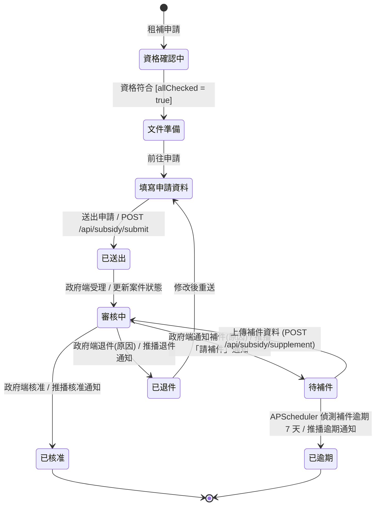

```mermaid
stateDiagram-v2
    direction TB

    state "資格確認中" as checking
    state "文件準備" as preparing
    state "填寫申請資料" as filling
    state "已送出" as submitted
    state "審核中" as reviewing
    state "待補件" as pending_docs
    state "已逾期" as expired
    state "已核准" as approved
    state "已退件" as rejected

    [*] --> checking : 租補申請

    checking --> preparing : 資格符合 [allChecked = true]

    preparing --> filling : 前往申請
    filling --> submitted : 送出申請 / POST /api/subsidy/submit

    submitted --> reviewing : 政府端受理 / 更新案件狀態
    reviewing --> pending_docs : 政府端通知補件(原因) / 推播「請補件」通知
    pending_docs --> reviewing : 上傳補件資料 (POST /api/subsidy/supplement)
    pending_docs --> expired : APScheduler 偵測補件逾期 7 天 / 推播逾期通知

    reviewing --> approved : 政府端核准 / 推播核准通知
    reviewing --> rejected : 政府端退件(原因) / 推播退件通知
    rejected --> filling : 修改後重送

    approved --> [*]
    expired --> [*]
```
