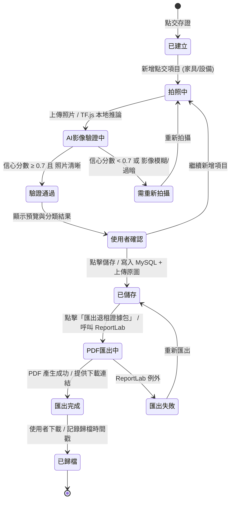

```mermaid
stateDiagram-v2
    direction TB

    state "已建立" as created
    state "拍照中" as photographing
    state "AI影像驗證中" as ai_verifying
    state "驗證通過" as verified
    state "需重新拍攝" as retake
    state "使用者確認" as user_confirm
    state "已儲存" as saved
    state "PDF匯出中" as exporting
    state "匯出完成" as exported
    state "匯出失敗" as export_failed
    state "已歸檔" as archived

    [*] --> created : 點交存證

    created --> photographing : 新增點交項目 (家具/設備)
    photographing --> ai_verifying : 上傳照片 / TF.js 本地推論

    ai_verifying --> verified : 信心分數 ≥ 0.7 且 照片清晰
    ai_verifying --> retake : 信心分數 < 0.7 或 影像模糊/過暗
    retake --> photographing : 重新拍攝

    verified --> user_confirm : 顯示預覽與分類結果
    user_confirm --> photographing : 繼續新增項目
    user_confirm --> saved : 點擊儲存 / 寫入 MySQL + 上傳原圖

    saved --> exporting : 點擊「匯出退租證據包」 / 呼叫 ReportLab
    exporting --> exported : PDF 產生成功 / 提供下載連結
    exporting --> export_failed : ReportLab 例外
    export_failed --> saved : 重新匯出

    exported --> archived : 使用者下載 / 記錄歸檔時間戳
    archived --> [*]
```
